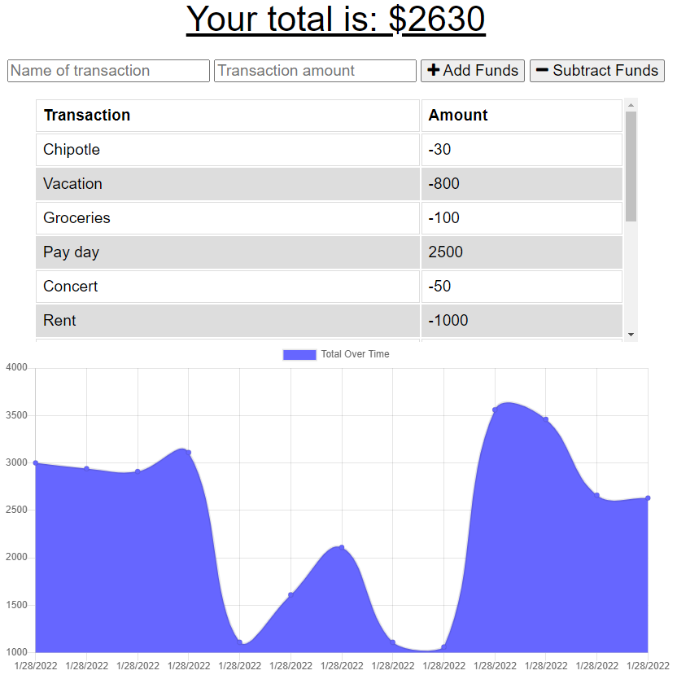

# budget-tracker

## Description
An application in which a user can track their monetary deposits and expenses and view the balance over time. 

## Usage
To use this application, click on deployed application link below:  
[Budget Tracker](https://sleepy-fjord-22801.herokuapp.com/)

## Installation
To install, click on 'Install Budget Tracker' to the right of URL in browser.

## Technologies
- HTML
- CSS
- JavaScript
- Node.js
- Express.js
- MongoDB

Provided with the following:
- IndexDB for offline usage
- Service workers capability for browsers that support it
- Web manifest for app installation

## Images
*Preview of application*

## Questions
Reach out to me on GitHub or contact me by email address.  
- [GitHub Profile](https://github.com/kngurley25)  
- kngurley25@gmail.com
